# Todo List Application Deployment Report

## Step 0: Creating the Todo List Application

### Backend (Node.js + PostgreSQL)

**Implementation:**
- Built Express server with 5 REST endpoints (CRUD operations)
- Configured PostgreSQL locally with:

```sql
CREATE TABLE todos (
  id SERIAL PRIMARY KEY,
  title VARCHAR(255) NOT NULL,
  completed BOOLEAN DEFAULT FALSE
);
```

- Used environment variables for security (.env file)
- Added CORS middleware for frontend communication
- Verified endpoints with Postman

**Evidence:**
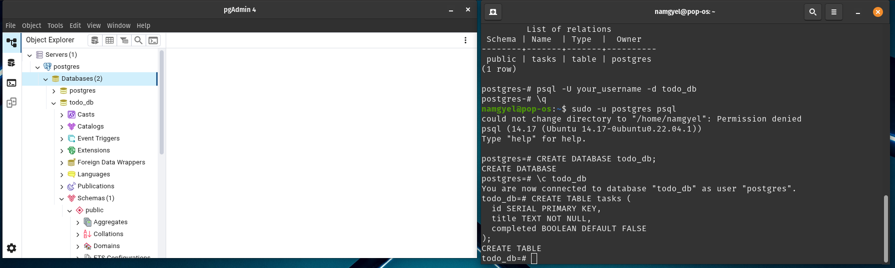
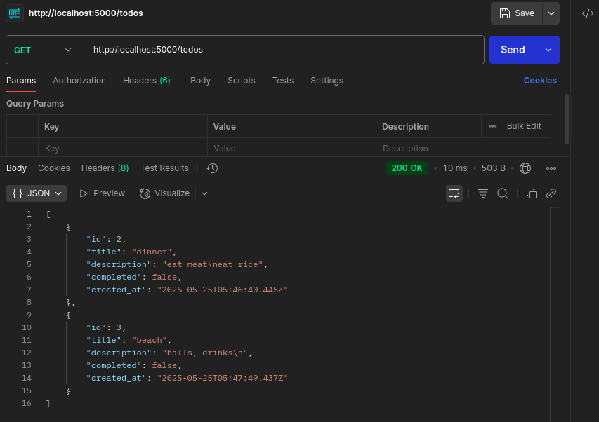

### Frontend (React)

**Implementation:**
- Created 3 components: TodoForm, TodoList, TodoItem
- Implemented API service with axios
- Environment configuration:

```plaintext
REACT_APP_API_URL=http://localhost:5000
```

- Added responsive CSS styling
- Tested against local backend:

**Evidence:**
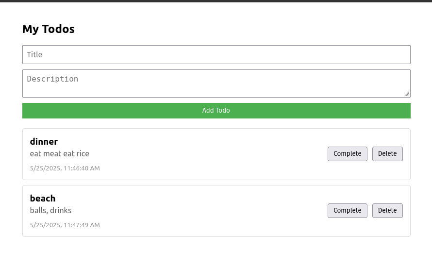

## Part A: Docker Deployment

### 1. Dockerizing the Application

**Backend Dockerfile:**
1. Local Docker Testing 
- build images
```
docker build -t todo-backend .
 docker build -t todo-frontend .
```
- Ran Containers
```
docker run -p 5000:5000 --env-file .env todo-backend
 docker run -p 3000:80 todo-frontend
```
- Verified

```dockerfile
FROM node:18-alpine
WORKDIR /app
COPY package*.json ./
RUN npm install
COPY . .
EXPOSE 5000
CMD ["node", "server.js"]
```
2. Push to Docker Hub
- Tagged Image
```
docker tag todo-backend namgyelhuk708/be-todo:02230291
docker tag todo-frontend namgyelhuk708/fe-todo:02230291
```
- Pushed Image
```
docker push namgyelhuk708/be-todo:02230291
docker push namgyelhuk708/fe-todo:02230291
```
**Frontend Dockerfile:**
```dockerfile
FROM node:18-alpine as build
WORKDIR /app
COPY . .
RUN npm install && npm run build

FROM nginx:alpine
COPY --from=build /app/build /usr/share/nginx/html
```

**Evidence:**
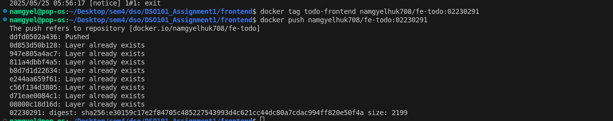
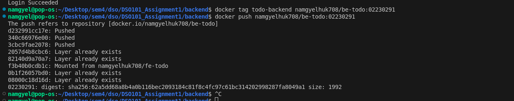
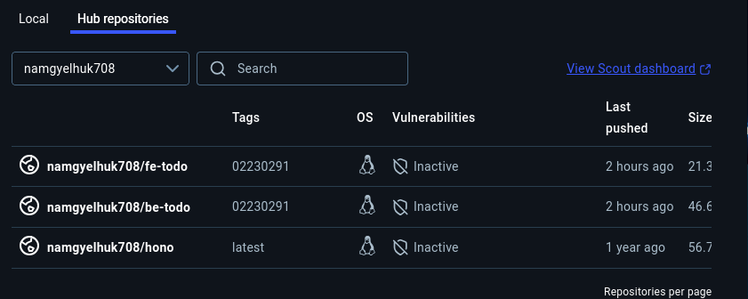

### 2. Deployment to Render

- Created a PostgreSQL database in Render
- Deployed backend as a Web Service:
- Selected "Existing image from Docker Hub"
- Used image of both be-todo and fe-todo: namgyelhuk708/be-todo:02230291

**Backend Service:**
- Image: `namgyelhuk708/be-todo:02230291`
- Environment variables:

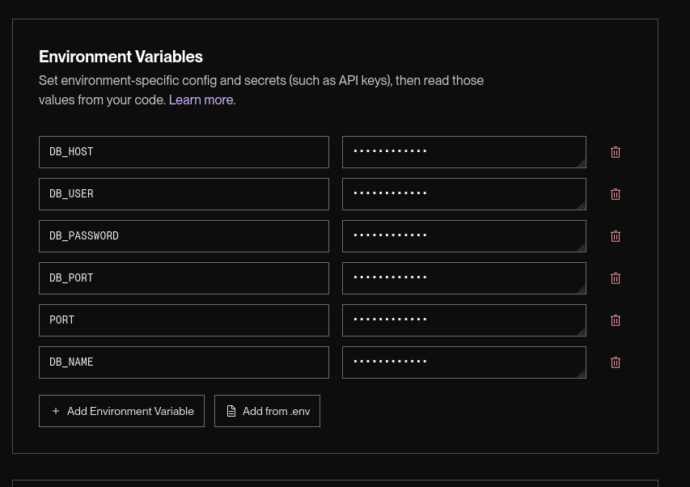

**Frontend Service:**
- Image: `namgyelhuk708/fe-todo:02230291`
- Environment variable:

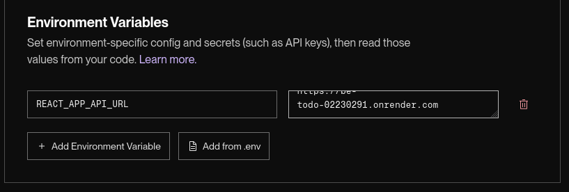

**Challenges:**
- **SSL Requirement:** Had to modify db.js:

```javascript
const pool = new Pool({
  ssl: { rejectUnauthorized: false }
});
```

- **Firewall Issues:** Whitelisted Render IPs in PostgreSQL

**Evidence:**
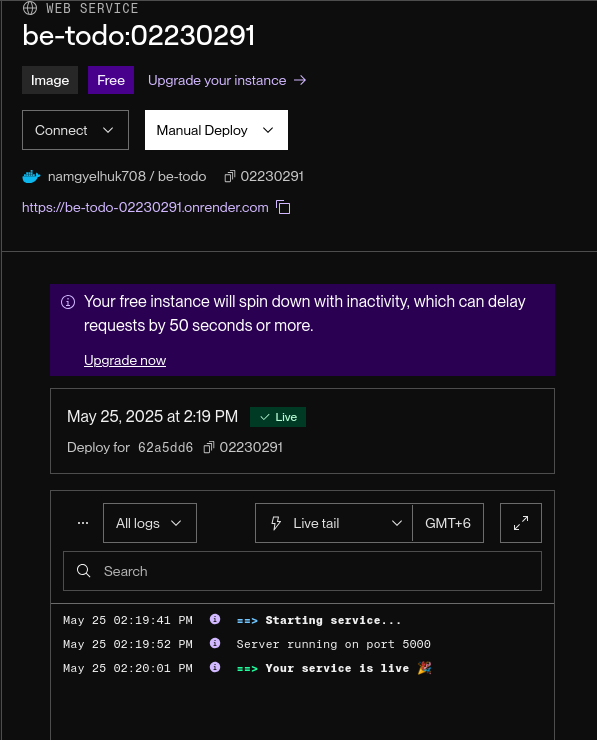
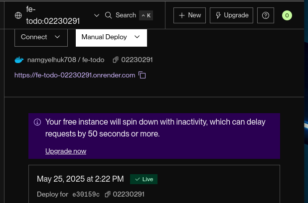

## Part B: Automated Deployment (render.yaml)

### 1. Implementation

**Repository Structure:**
```
/Repo
  /frontend
    Dockerfile
    .env.production
  /backend
    Dockerfile
    .env.production
  render.yaml
```

**render.yaml:**
```yaml
services:
  - type: web
    name: be-todo
    plan: free
    env: docker
    dockerfilePath: ./backend/Dockerfile
    envVars:
      - key: DB_HOST
        value: dpg-xxxxxx-postgres.render.com
      - key: DB_PORT
        value: 5432
      - key: DB_USER
        value: render_db_user
      - key: DB_PASSWORD
        value: auto_generated_password

  - type: web
    name: fe-todo
    plan: free
    env: docker
    dockerfilePath: ./frontend/Dockerfile
    envVars:
      - key: REACT_APP_API_URL
        value: https://be-todo.onrender.com
```

### 2. Challenges Faced

**Payment Requirement:**
- Render now mandates card for free tier

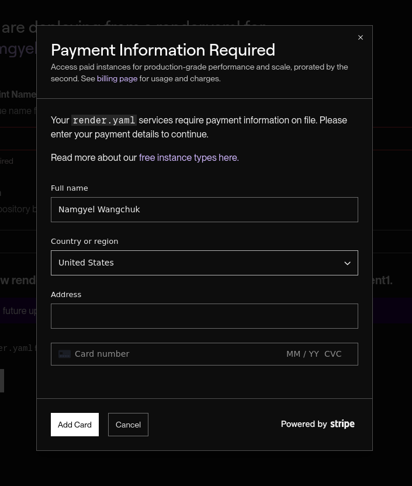

**Path Configuration:**
- Initially failed due to incorrect Dockerfile paths
- Fixed with:

```yaml
dockerfilePath: ./frontend/Dockerfile  # Instead of /images/frontend/
```

**Automatic Deployment:**
- First push didn't trigger build
- Solution: Manually connected repo in Render dashboard but to continue need paid version.

## Conclusion

### Key Achievements
✅ Full CI/CD pipeline from local development to production  
✅ Dockerized deployment with environment-specific configurations  
✅ Automated builds via GitHub integration  

### Areas for Improvement
⚠️ Need error monitoring for production (e.g., Sentry)  
⚠️ Better secret management for database credentials  

### Final Verification
- **Backend:** https://be-todo-02230291.onrender.com
- **Frontend:** https://fe-todo-02230291.onrender.com shows functional UI

---

## Tech Stack
- **Frontend:** React, Axios
- **Backend:** Node.js, Express
- **Database:** PostgreSQL
- **Deployment:** Docker, Render
- **CI/CD:** GitHub Actions with render.yaml