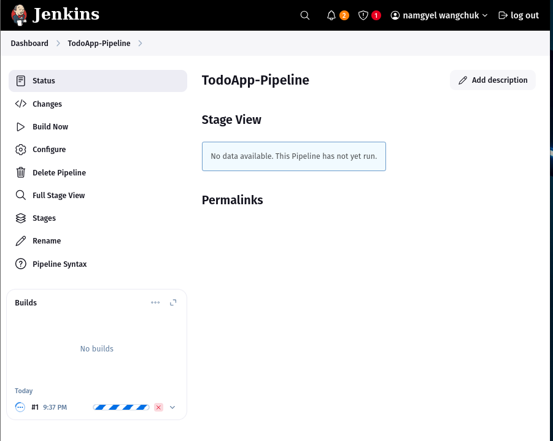
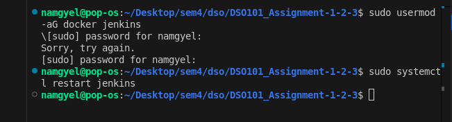
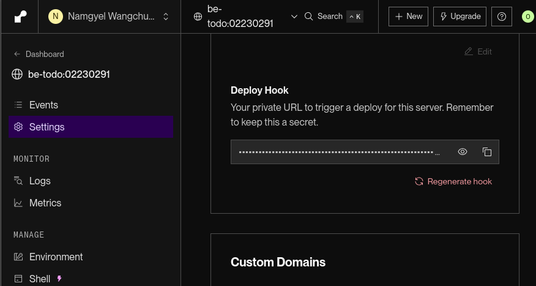

# Todo List Application Deployment Report

## Step 0: Creating the Todo List Application

### Backend (Node.js + PostgreSQL)

**Implementation:**
- Built Express server with 5 REST endpoints (CRUD operations)
- Configured PostgreSQL locally with:

```sql
CREATE TABLE todos (
  id SERIAL PRIMARY KEY,
  title VARCHAR(255) NOT NULL,
  completed BOOLEAN DEFAULT FALSE
);
```

- Used environment variables for security (.env file)
- Added CORS middleware for frontend communication
- Verified endpoints with Postman

**Evidence:**


### Frontend (React)

**Implementation:**
- Created 3 components: TodoForm, TodoList, TodoItem
- Implemented API service with axios
- Environment configuration:

```plaintext
REACT_APP_API_URL=http://localhost:5000
```

- Added responsive CSS styling
- Tested against local backend:

**Evidence:**


## Part A: Docker Deployment

### 1. Dockerizing the Application

**Backend Dockerfile:**
1. Local Docker Testing 
- build images
```
docker build -t todo-backend .
 docker build -t todo-frontend .
```
- Ran Containers
```
docker run -p 5000:5000 --env-file .env todo-backend
 docker run -p 3000:80 todo-frontend
```
- Verified

```dockerfile
FROM node:18-alpine
WORKDIR /app
COPY package*.json ./
RUN npm install
COPY . .
EXPOSE 5000
CMD ["node", "server.js"]
```
2. Push to Docker Hub
- Tagged Image
```
docker tag todo-backend namgyelhuk708/be-todo:02230291
docker tag todo-frontend namgyelhuk708/fe-todo:02230291
```
- Pushed Image
```
docker push namgyelhuk708/be-todo:02230291
docker push namgyelhuk708/fe-todo:02230291
```
**Frontend Dockerfile:**
```dockerfile
FROM node:18-alpine as build
WORKDIR /app
COPY . .
RUN npm install && npm run build

FROM nginx:alpine
COPY --from=build /app/build /usr/share/nginx/html
```

**Evidence:**


### 2. Deployment to Render

- Created a PostgreSQL database in Render
- Deployed backend as a Web Service:
- Selected "Existing image from Docker Hub"
- Used image of both be-todo and fe-todo: namgyelhuk708/be-todo:02230291

**Backend Service:**
- Image: `namgyelhuk708/be-todo:02230291`
- Environment variables:


**Frontend Service:**
- Image: `namgyelhuk708/fe-todo:02230291`
- Environment variable:


**Challenges:**
- **SSL Requirement:** Had to modify db.js:

```javascript
const pool = new Pool({
  ssl: { rejectUnauthorized: false }
});
```

- **Firewall Issues:** Whitelisted Render IPs in PostgreSQL

**Evidence:**


## Part B: Automated Deployment (render.yaml)

### 1. Implementation

**Repository Structure:**
```
/Repo
  /frontend
    Dockerfile
    .env.production
  /backend
    Dockerfile
    .env.production
  render.yaml
```

**render.yaml:**
```yaml
services:
  - type: web
    name: be-todo
    plan: free
    env: docker
    dockerfilePath: ./backend/Dockerfile
    envVars:
      - key: DB_HOST
        value: dpg-xxxxxx-postgres.render.com
      - key: DB_PORT
        value: 5432
      - key: DB_USER
        value: render_db_user
      - key: DB_PASSWORD
        value: auto_generated_password

  - type: web
    name: fe-todo
    plan: free
    env: docker
    dockerfilePath: ./frontend/Dockerfile
    envVars:
      - key: REACT_APP_API_URL
        value: https://be-todo.onrender.com
```

### 2. Challenges Faced

**Payment Requirement:**
- Render now mandates card for free tier


**Path Configuration:**
- Initially failed due to incorrect Dockerfile paths
- Fixed with:

```yaml
dockerfilePath: ./frontend/Dockerfile  # Instead of /images/frontend/
```

**Automatic Deployment:**
- First push didn't trigger build
- Solution: Manually connected repo in Render dashboard but to continue need paid version.

## Conclusion

### Key Achievements
✅ Full CI/CD pipeline from local development to production  
✅ Dockerized deployment with environment-specific configurations  
✅ Automated builds via GitHub integration  

### Areas for Improvement
⚠️ Need error monitoring for production (e.g., Sentry)  
⚠️ Better secret management for database credentials  

### Final Verification
- **Backend:** https://be-todo-02230291.onrender.com
- **Frontend:** https://fe-todo-02230291.onrender.com shows functional UI

---

## Tech Stack
- **Frontend:** React, Axios
- **Backend:** Node.js, Express
- **Database:** PostgreSQL
- **Deployment:** Docker, Render
- **CI/CD:** GitHub Actions with render.yaml


# Assignment II: CI/CD Pipeline for Node.js Todo Application

## Objective

This assignment involved configuring a **Jenkins CI/CD pipeline** to automate the **build, test, and deployment** of a **Node.js-based Todo application** from Assignment 1. The workflow integrates:

- ✔ **GitHub** (source code)
- ✔ **Node.js & npm** (dependency management)
- ✔ **Jest** (testing)
- ✔ **Docker** (containerization & deployment)

## Pipeline Implementation

### 1. Jenkins Setup

- Installed Jenkins from [jenkins.io/download](https://jenkins.io/download)
- Ran Jenkins on `localhost:8080`
- Installed required plugins:
**MAnager Jenkins > Plugins**
  - **NodeJS Plugin** (for npm)
  - **Pipeline**
  - **GitHub Integration**
  - **Docker Pipeline**

### 2. Node.js Configuration

- **Managed Jenkins > Tools > NodeJS**
- Added **Node.js v24.0.2** with automatic installation
- Verified npm detection


### 3. GitHub Integration

- Created a **GitHub Personal Access Token (PAT)** with:
  - `repo`
  - `admin:repo_hook` permissions


- Added GitHub credentials in Jenkins (**Manage Jenkins > Credentials**)


### 4. Jenkinsfile Implementation
- Created a Jenkinsfile on the root directory


- The pipeline includes **5 stages**:

1. **Checkout** – Clones the GitHub repository
2. **Install** – Runs `npm install`
3. **Build** – Executes `npm run build` (if applicable)
4. **Test** – Runs Jest unit tests with JUnit reporting
5. **Deploy** – Builds & pushes Docker image to Docker Hub

**Example Jenkinsfile:**

```groovy
pipeline {
    agent any
    tools {
        nodejs 'NodeJS 24.0.2'
    }
    stages {
        // Stage 1: Checkout Code
        stage('Checkout') {
            steps {
                git branch: 'main',
                    url: 'https://github.com/NamgyelHuk708/DSO101_Assignment-1-2-3'
            }
        }
        
        // Stage 2: Install Dependencies (Backend)
        stage('Install Backend') {
            steps {
                dir('backend') {
                    sh 'npm install'
                }
            }
        }
        
        // Stage 2b: Install Dependencies (Frontend)
        stage('Install Frontend') {
            steps {
                dir('frontend') {
                    sh 'npm install'
                }
            }
        }
        
        // Stage 3: Build Backend (if applicable)
        stage('Build Backend') {
            steps {
                dir('backend') {
                    sh 'npm run build || echo "No build script in backend, continuing"'
                }
            }
        }
        
        // Stage 3b: Build Frontend (React/TypeScript)
        stage('Build Frontend') {
            steps {
                dir('frontend') {
                    sh 'npm run build'
                }
            }
        }

        // Stage 4: Run Backend Unit Tests
        stage('Test Backend') {
            steps {
                dir('backend') {
                    sh 'npm test || echo "No test script in backend, continuing"'
                }
            }
            post {
                always {
                    junit allowEmptyResults: true, testResults: 'backend/junit.xml'
                }
            }
        }
        
        // Stage 4b: Run Frontend Unit Tests
        stage('Test Frontend') {
            steps {
                dir('frontend') {
                    sh 'npm test || echo "No test script in frontend, continuing"'
                }
            }
            post {
                always {
                    junit allowEmptyResults: true, testResults: 'frontend/junit.xml'
                }
            }
        }
        
        // Stage 5: Deploy (Docker Example)
        stage('Deploy') {
            steps {
                script {
                    // Build Docker image using backend Dockerfile
                    sh 'docker build -t namgyelhuk708/node-app:latest -f backend/Dockerfile backend/'
                    
                    // Push to Docker Hub (requires credentials)
                    withCredentials([string(credentialsId: 'docker-password', variable: 'DOCKER_PWD')]) {
                        sh 'echo $DOCKER_PWD | docker login -u namgyelhuk708 --password-stdin'
                        sh 'docker push namgyelhuk708/node-app:latest'
                    }
                }
            }
        }
    }
}
```
### 5. Pipeline Execution
- Created a new Jenkins Pipeline item
- Configured it to use Pipeline script from SCM (Git)
- Provided the repository URL and credentials
- Set the script path to "Jenkinsfile"


- Build and monitored the pipeline execution



Successful pipeline execution after 13 attempts


- Docker Hub Image


## Challenges & Solutions
**1. Challenge 1:**  
Jenkins File not in the git repo  


**Solution:** add the changes and push to repo |

**Challenge 2:** 
Docker push failed (authentication)


**Solution:** 
- Added Docker Hub credentials in Jenkins and referenced in pipeline
- Added the Jenkins user to the Docker group to give permission to connect to Docker Daemon socket:
```
sudo usermod -aG docker jenkins
```
- Restarted both Docker and Jenkins services:
```
sudo systemctl restart docker
```
```
sudo systemctl restart jenkins
```



**Challenge 3:**
Credentials type mismatch in the Jenkins pipelin


**Solution:** Update the credential


## Results

**Successful Pipeline Execution**

- **Build Logs:** Verified `npm install`, `npm test`, and Docker build
- **Docker Hub Image:** namgyelhuk708/node-app
- **GitHub Repo:** DSO101_Assignment-1-2-3

## Conclusion

- Successfully automated **CI/CD** for the Todo app using **Jenkins**.
- Resolved multiple failures (**Node.js setup,Docker daemon, Docker auth, test reports**).
- Final pipeline: **Builds → Tests → Deploys** seamlessly.

# DSO101 Assignment III: Todo App CI/CD Deployment with GitHub Actions

## Objective

The goal of this assignment was to implement a fully automated CI/CD pipeline for a full-stack Todo list application using  using Docker, GitHub Actions, DockerHub, and Render.com. The setup involved containerizing the application with Docker, automating builds and deployment through GitHub Actions, storing container images on DockerHub, and deploying the application to the cloud using Render.com.

## Project Structure

The project consists of two components:

- **frontend/**: React-based UI for the TODO application
- **backend/**: Node.js (Express) API to manage tasks

Each component is independently containerized and deployed using Docker and Render.

```
/
├── backend/
│   ├── package.json
│   ├── Dockerfile
│   └── ...
├── frontend/
│   ├── package.json
│   ├── Dockerfile
│   └── ...
└── .github/
    └── workflows/
        └── deploy.yml
```

## Implementation Steps

### 1. Repository Setup

- Verified that both the **frontend** and **backend** directories included valid `package.json` files with the required `start` and `test` scripts
- Confirmed that the repository was **public** for workflow accessibility
- Ensured proper Dockerfiles were present in both components, following the Node.js container best practices

### 2. Dockerfiles Configuration

Created Dockerfiles using the official Node.js Alpine image to keep the containers lightweight. Each file installs dependencies, runs optional tests, and starts the app.

**Common Dockerfile Template:**

```dockerfile
FROM node:20-alpine
WORKDIR /app
COPY package*.json ./
RUN npm install
COPY . .
RUN npm test
EXPOSE 5000
CMD ["npm", "start"]
```

### 3. GitHub Actions Workflow

Configured a workflow file at `.github/workflows/deploy.yml` to automate:

- Code checkout
- DockerHub login using secrets
- Building and pushing Docker images for both frontend and backend
- Triggering Render deployments via deploy webhooks


### 4. GitHub Secrets Management

- Get the Docker credientials from the DockerHub


Under **Settings → Secrets and variables → Actions**, the following secrets were securely added:

- `DOCKERHUB_USERNAME`: DockerHub username
- `DOCKERHUB_TOKEN`: Personal access token with read/write permissions
- `RENDER_BACKEND_WEBHOOK_URL`: Backend deploy webhook from Render
- `RENDER_FRONTEND_WEBHOOK_URL`: Frontend deploy webhook from Render




### 5. Render Deployment Configuration

- Deployed both services on Render.com using the "Deploy an existing Docker image" option
- Obtained deploy webhook URLs and connected them to GitHub Actions via secrets (same like in step 4)


### 6. Pipeline Execution

- Pushed changes to the main branch, which automatically triggered the CI/CD pipeline
- Workflow successfully completed all stages:
  - Docker images were built and pushed
  - Webhooks triggered the deployment
  - Applications became available live on the web


### 7. Testing & Validation

- Verified Docker image presence in DockerHub for both services
- Verified that it deployed via Deploy Hook


## Challenges Faced

### Secrets Misplacement

Initially added secrets under "Codespaces" instead of "Actions", which caused authentication errors. Moving them to the correct location fixed the issue.

### DockerHub Token Scope

The token had insufficient permissions initially as there were Credientials mismatch. Regenerating it with the correct scopes and have the consistence naming that resolved push failures.


## Key Learnings

- Used GitHub Actions to automate CI/CD with YAML workflows.
- Deployed both React frontend and Node.js backend using Docker.
- Automated deployments on Render.com using webhooks.
- Securely managed credentials with GitHub Secrets.
- Set up a full DevOps pipeline from code commit to live deployment.

## Conclusion
*This assignment provided a practical and holistic experience of implementing CI/CD pipelines in a real-world context. By leveraging Docker, GitHub Actions, DockerHub, and Render.com, the deployment workflow has been fully automated.

With each new push to the main branch, the application now builds, publishes, and deploys automatically demonstrating production ready DevOps lifecycle.*

# Assignment IV:Secure CI/CD Pipeline with Docker, GitHub Actions & Jenkins

## Objective

The goal of this assignment was to implement a secure Continuous Integration and Continuous Deployment (CI/CD) pipeline using:

- Docker
- GitHub Actions
- Jenkins

Security best practices were applied to:

- Avoid exposing secrets (e.g., DockerHub credentials)
- Prevent containers from running as root
- Secure image build and deployment processes
- Control release workflows to run only from trusted branches (e.g., main)

## Implementation Steps

### 1. Dockerfile Security: Running Containers as Non-Root

To reduce the attack surface of our containers, both the frontend and backend Dockerfiles were updated to run under non-root users.

- Users created:
  - `node` for backend
  - `nginx` for frontend
- Ownership and permissions were adjusted so these users had proper access to application files
- Used the `USER` directive in each Dockerfile to drop privileges from root to the created users


### 2. Securing DockerHub Credentials with GitHub Secrets

To avoid hardcoding sensitive credentials, DockerHub tokens and usernames were stored securely using GitHub Secrets.

- Secrets added under: **GitHub → Settings → Secrets and variables → Actions:**
  - `DOCKERHUB_USERNAME`
  - `DOCKERHUB_TOKEN`
- Secure login was handled using `docker/login-action@v3`, which masked all credential-related steps from logs
- Secrets were referenced in workflows via `${{ secrets.DOCKERHUB_USERNAME }}` and `${{ secrets.DOCKERHUB_TOKEN }}`


### 3. GitHub Actions: deploy.yml – Secure Multi-Step Deployment

The `deploy.yml` workflow was rewritten to streamline and secure the deployment of both services, using GitHub Actions best practices.

**Build & Push Strategy:**

- Built both frontend and backend Docker images
- Used `docker/build-push-action@v6` for a secure, encapsulated image build process
- Restricted execution to the main branch using `on: push: branches: ['main']`

**Security Enhancements:**

- Secrets were used for DockerHub login and Render webhook URLs
- Avoided direct docker build commands to reduce secret leakage risk
- Used curl to trigger deployments on Render.com via secure webhooks

*[Insert screenshot: GitHub Actions deploy logs]*  
*[Insert screenshot: DockerHub showing secure pushed images]*

### 4. GitHub Actions: docker-publish.yml – Secure Parallel Builds

To enhance modularity and fault isolation, the `docker-publish.yml` workflow was updated to run parallel jobs for frontend and backend builds.

**Workflow Design:**

- Defined two independent jobs:
  - `build-and-push-image1`: Builds & pushes frontend
  - `build-and-push-image2`: Builds & pushes backend
- Each job:
  - Checked out the source code
  - Logged into DockerHub securely using `docker/login-action@v3`
  - Used `docker/build-push-action@v6` for a secure build pipeline

**Benefits:**

- Clear separation of concerns
- Simplified troubleshooting
- Safer and cleaner logs

*[Insert screenshot: GitHub Actions job matrix]*  
*[Insert screenshot: DockerHub with distinct frontend/backend image tags]*

### 5. Jenkins Pipeline: Secure Docker Build and Push

A secure Jenkins pipeline was configured to automate Docker builds and image uploads to DockerHub without exposing sensitive data.

**Credential Handling:**

- DockerHub credentials were stored in Jenkins as `docker-hub-creds`
- The pipeline securely injected credentials using `credentials('docker-hub-creds')`

**Pipeline Stages:**

- **Checkout**: Pulled code from the Git repository
- **Build**: Created the Docker image
- **Login & Push**: Logged into DockerHub using:
  ```bash
  echo $DOCKER_CREDS_PSW | docker login -u $DOCKER_CREDS_USR --password-stdin
  ```
  - Ensured password wasn't echoed or exposed

Updated the credentials


Jenkins Build successful


DockerHub showing secure pushed image


## Challenges Faced

- Non-root user changes initially caused permission issues during container builds
- Debugging secret usage to ensure no leaks in GitHub Actions or Jenkins logs
- Jenkins' `credentials()` syntax required careful testing to get credential binding correct
- Webhook URL references from GitHub Secrets needed precise formatting to trigger Render correctly

## Key Learnings

- **Container Hardening**: Avoiding root user execution in Docker significantly enhances runtime security
- **Secret Hygiene**: GitHub Secrets and Jenkins Credentials are essential for safe, audit-proof automation
- **Controlled Deployment**: Using main-only triggers prevents unintended production deployments
- **Reusable Actions**: GitHub's login and build-push actions are more secure and easier to maintain than raw shell commands
- **Pipeline Modularity**: Splitting workflows (e.g., parallel image builds) improves readability and CI/CD maintenance

## Conclusion

This assignment successfully demonstrated how to build a secure, maintainable, and automated CI/CD pipeline by integrating:

- **Docker**: with non-root users and secure builds
- **GitHub Actions**: for automated, secret-aware CI/CD workflows
- **Jenkins**: for credential-injected, stage-driven Docker automation

The final pipeline is:

- Secure against common vulnerabilities like root execution and credential exposure
- Limited to trusted branch triggers
- Integrated with external deployment services like Render.com
- Modular, maintainable, and ready for production environments

By applying modern DevSecOps principles, we ensured that our pipeline is not only functional but resilient and security-first by design.